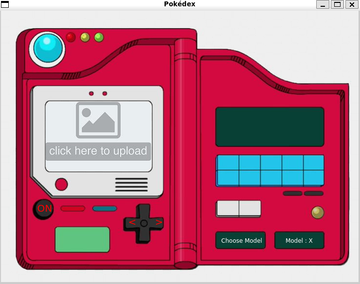

# Pokedex 

This project is a cat and dog project revisited with Pokémon. It is implemented entirely in Python with PyQt5 for the interface. Currently, it supports only Bulbasaur, Charmander, Pikachu, and Squirtle.

The project consists of two Python files:

- code_final.py: How we design and train our model. You can freely modify it or replace it with your own model.

- inter.py: Implements the graphical interface.




## Interface

To start the interface, run:

```bash
python3 inter.py
```

## Interface Overview

- **Image Drop Zone**  
  Click to drop a Pokémon image. The interface accepts .jpg, .jpeg, and .png files.

- **Choose Model Button**  
  Click to select a model (.keras or .h5). Place your model file in the CNN_models folder. The model filename must include the input image size in the format {width}x{height}, for example "cnn_model_256x256.keras". You can modify the accepted extensions in the selectModel() method. Once a valid model is selected, the status label changes from Model: X to Model: ✓.

- **On Button**  
  Click to run prediction. An image and a model must be loaded first.

- **Navigation Arrows**  
  Use the left and right arrows to browse through images you put. After dropping an image, you can't change it, you need to use the right arrow to return to an empty view.
